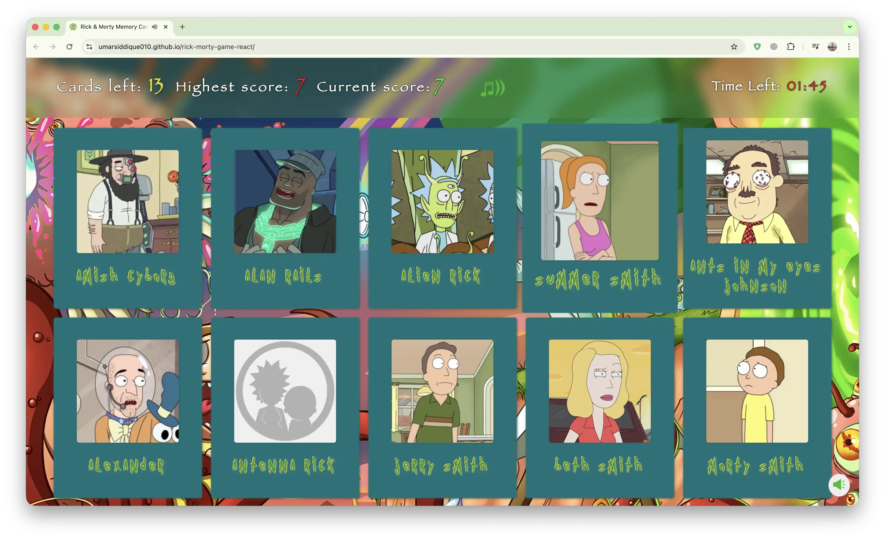

#  Rick & Morty Memory Game

<div align="center">

### A React Class-Component Masterclass.

<p align="center">
  <strong>A production-grade React application engineered to demonstrate a deep understanding of core React fundamentals. Built entirely with Class-Based Components to showcase explicit lifecycle management, rigorous state architecture, and enterprise-level CI pipelines.</strong>
</p>

<p align="center">
  <a href="https://umarsiddique010.github.io/rick-morty-game-react/"><strong>View Live Production Deployment</strong></a>
  &nbsp;&nbsp;&bull;&nbsp;&nbsp;
  <a href="#setup-instructions"><strong>Local Setup</strong></a>
  &nbsp;&nbsp;&bull;&nbsp;&nbsp;
  <a href="https://github.com/umarSiddique010/rick-morty-game-react"><strong>Repository</strong></a>
  &nbsp;&nbsp;&bull;&nbsp;&nbsp;
  <a href="https://github.com/umarSiddique010/rick-morty-game-react/issues"><strong>Report an Issue</strong></a>
</p>

[](https://reactjs.org/)
[](https://developer.mozilla.org/en-US/docs/Web/JavaScript)
[](https://jestjs.io/)
[](https://motion.dev/)
[](https://typicode.github.io/husky/)
[](https://eslint.org/)
[](https://prettier.io/)
[](https://github.com/features/actions)
[](https://pages.github.com/)

</div>

---

## Overview

This repository demonstrates **"Class Components done right"** — a deliberate architectural choice in an era dominated by Hooks. `App.js` acts as the single source of truth, lifting state up and passing callbacks down, ensuring strict unidirectional data flow across the entire game.

## Game Preview



## Features & Architecture

### 1. The Philosophy: Why Class Components?

In an era dominated by Functional Components and Hooks, this project serves as a deliberate architectural showcase of core React fundamentals. By strictly utilizing Class Components, this codebase demonstrates:

- **Explicit Lifecycle Management:** Granular control using `componentDidMount` (API calls and timers), `componentDidUpdate` (score tracking and game-over logic), and `componentWillUnmount` (clearing intervals and audio streams to prevent memory leaks)
- **Context Binding & `this`:** A deep understanding of JavaScript scope, `this` binding in constructors, and event handler management without relying on `useCallback`
- **State Architecture:** `App.js` as the single source of truth — state lifted up, callbacks passed down, unidirectional data flow enforced throughout

### 2. Core Gameplay

- 3 difficulty levels — Easy (210s), Medium (120s), Hard (40s)
- Click each card only once; duplicate click = Game Over
- High score persisted to `localStorage` across sessions

### 3. Key Technical Features

- **Rick & Morty API** — Characters fetched asynchronously in `CardContainer`'s `componentDidMount` with loading and error states
- **Audio Engine** — Dedicated `GameSounds.js` class managing BGM, SFX, and global mute toggle, fully decoupled from UI
- **Animations** — `motion/react` spring physics for entrance/exit transitions on the game board and modals
- **CSS Modules** — Scoped styles, zero class name collisions

### 4. Testing

- Unit tests for isolated components (`Card`, `TimerBoard`, `ScoreBoard`)
- Integration tests in `App.test.js` covering full user flows — start game, card clicks, Game Over
- `GameSounds.js` fully mocked in `src/__mocks__/`; global `fetch` mocked for deterministic API tests
- Coverage enforced in CI via `npm run test:coverage`

### 5. CI Pipeline

Every push and PR must pass `.github/workflows/ci.yml` before merging:

- ESLint → Prettier format check → Jest coverage → coverage report uploaded as CI artifact

## Tech Stack

| Category           | Technology                    | Usage                                                                                 |
| :----------------- | :---------------------------- | :------------------------------------------------------------------------------------ |
| **Core Framework** | **React 19**                  | Class-Based Components, lifecycle methods                                             |
| **Bundler**        | **Create React App**          | Build tooling; intentionally chosen over Vite for CRA + class component compatibility |
| **Language**       | **JavaScript (ES6+)**         | Class architecture, `this` binding                                                    |
| **Styling**        | **CSS Modules**               | Scoped styles, zero collisions                                                        |
| **Animation**      | **Motion (`motion/react`)**   | Spring physics, entrance/exit animations                                              |
| **Audio**          | **Web Audio API**             | Custom `GameSounds` class for SFX and BGM                                             |
| **Testing**        | **Jest + RTL**                | Unit and integration tests                                                            |
| **Code Quality**   | **ESLint + Prettier + Husky** | Pre-commit and CI enforcement                                                         |
| **CI**             | **GitHub Actions**            | Lint → Format → Test → Coverage artifact                                              |
| **Hosting**        | **GitHub Pages**              | Manual deployment via `npm run deploy`                                                |

## Setup Instructions

### Prerequisites

- Node.js v18 or v20
- npm

### 1. Clone & Install

```bash
git clone https://github.com/umarSiddique010/rick-morty-game-react.git
cd rick-morty-game-react
npm install --legacy-peer-deps
```

> `--legacy-peer-deps` is required — CRA has peer dependency conflicts with React 19.

### 2. Run

```bash
npm start
```

Open [http://localhost:3000](http://localhost:3000).

### 3. Quality Checks

```bash
npm run lint
npm run format:check
npm run test:coverage
```

### 4. Deploy to GitHub Pages

```bash
npm run deploy
```

> This runs `npm run build` then pushes the build to the `gh-pages` branch. Deployment is manual — run this only after all quality checks pass.

## Project Structure

```
src/
├── __mocks__/             # Jest mock for GameSounds and Audio API
├── __test__/              # Full test suite (Unit & Integration)
├── assets/                # Fonts, images, wallpaper
├── Components/
│   ├── Card/              # Individual memory card
│   ├── CardContainer/     # Card grid + API fetching
│   ├── GameOver/          # Game Over modal
│   ├── PlayGame/          # Main game orchestrator
│   ├── ScoreBoard/        # Score, high score, cards left HUD
│   ├── SoundToggleButton/ # Global mute control
│   ├── StartGame/         # Landing page and difficulty selection
│   └── TimerBoard/        # Countdown timer
├── App.js                 # Root component and state container
├── GameSounds.js          # Audio class: SFX and BGM
└── index.css              # Global CSS variables and resets
```

---

<div align="center">

### Developer & Maintainer

**Md Umar Siddique**

<p align="center">
  <a href="https://www.umarsiddique.dev/">
    
  </a>
  <a href="https://www.linkedin.com/in/md-umar-siddique-1519b12a4/">
    
  </a>
  <a href="https://github.com/umarSiddique010">
    
  </a>
  <a href="https://www.npmjs.com/~umarsiddique010">
    
  </a>
  <a href="https://dev.to/umarsiddique010">
    
  </a>
   <a href="mailto:us70763@gmail.com">
  
</a>
</p>

&copy; 2024 - Present. Released under the MIT License.

</div>
